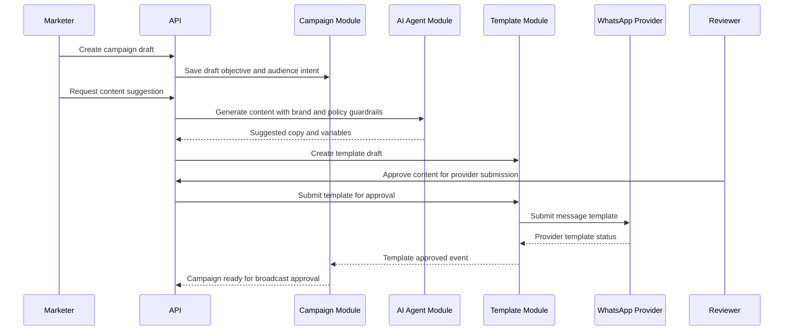
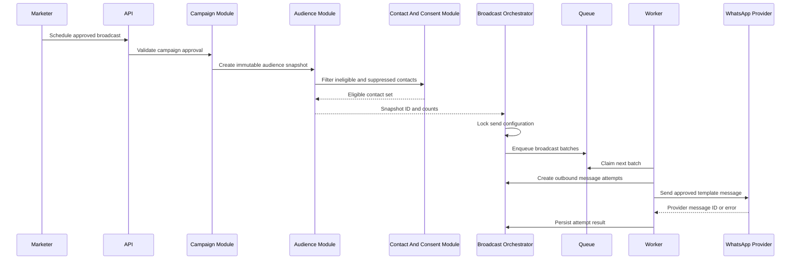
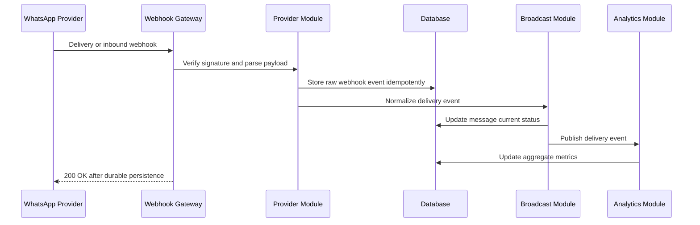
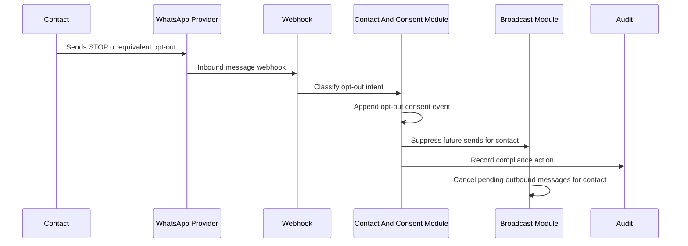
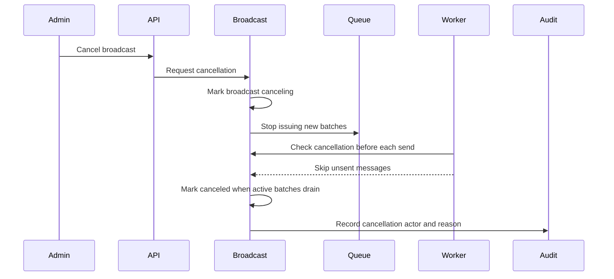
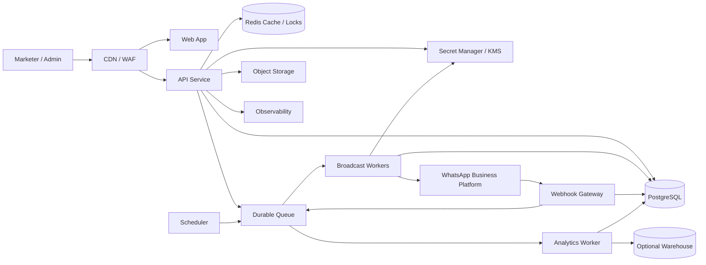

# Marketing Agent Architecture Review

Date: 2026-06-16  
Role: Principal Solution Architect / Staff Engineering Review  
Scope: Requirements-level architecture for a Marketing Agent with WhatsApp broadcast capability.

## Executive Summary

The current repository contains no application code, database schema, requirements document, or deployment manifests. This review is therefore a target architecture, not a verification of an implemented system. That absence is itself a material architecture risk: the team should not begin implementation until ownership boundaries, consent semantics, WhatsApp provider constraints, and data retention requirements are agreed.

Recommended architectural stance:

- Start as a modular monolith with strict module boundaries, shared database, and asynchronous workers. Do not start with distributed microservices unless independent scaling, release cadence, or compliance isolation already exists.
- Treat consent, opt-out, template approval, provider message IDs, idempotency, and auditability as core domain concerns, not integration details.
- Use PostgreSQL as the source of truth, a durable queue for broadcast fan-out, object storage for large imports/exports, and a provider adapter for WhatsApp Cloud API or an approved BSP.
- Design WhatsApp broadcast around approved templates, explicit opt-in, throttled delivery, retries, webhook reconciliation, and hard suppression on opt-out.
- Keep AI-generated marketing content behind review, policy checks, brand guardrails, and template approval workflows. The agent can assist; it should not autonomously broadcast.

External platform references used:

- WhatsApp Business Platform: https://business.whatsapp.com/products/business-platform
- WhatsApp Business Platform overview and platform behavior: https://developers.facebook.com/docs/whatsapp/
- WhatsApp Cloud API: https://developers.facebook.com/docs/whatsapp/cloud-api/
- WhatsApp message templates: https://developers.facebook.com/docs/whatsapp/business-management-api/message-templates/
- WhatsApp webhooks: https://developers.facebook.com/docs/whatsapp/cloud-api/webhooks/
- WhatsApp pricing: https://business.whatsapp.com/products/platform-pricing
- WhatsApp Business Messaging Policy: https://www.whatsapp.com/legal/business-policy/

## Assumptions

- Product: multi-tenant marketing platform for importing contacts, creating segments, generating/reviewing campaign content, and broadcasting WhatsApp template messages.
- Users: internal marketers, admins, reviewers, support/ops, and possibly automated agents.
- Tenancy: organizations or workspaces own contacts, templates, campaigns, broadcasts, and analytics.
- Primary channel: WhatsApp Business Platform. Additional channels may be added later but should not distort the first design.
- Compliance: opt-in and opt-out enforcement is mandatory. Marketing messages must not be sent without valid consent.
- Delivery: high-volume broadcasts are asynchronous and must survive process restarts.

## 1. Domain Model

### Core Aggregates

**Tenant / Workspace**

- Owns all business data.
- Has settings for time zone, locale, sending windows, default opt-out keywords, WhatsApp business account, and billing/quota.
- Tenant isolation must be present in every query, queue payload, analytics job, and object storage path.

**User**

- Member of one or more tenants.
- Assigned roles such as owner, admin, marketer, reviewer, analyst, support, or integration admin.
- Performs auditable actions: imports, template submissions, campaign approvals, broadcast starts, cancellations, exports.

**Contact**

- Represents a reachable person.
- Canonical identity should be `tenant_id + phone_e164`, not raw uploaded phone strings.
- Stores profile attributes separately from consent events.
- Must support suppression state: active, opted_out, blocked, invalid_phone, deleted, do_not_contact.

**Consent**

- Append-only history of opt-in, opt-out, source, timestamp, policy version, capture evidence, and channel.
- Current consent state can be materialized for performance, but the event history is authoritative.
- Poor design to avoid: a mutable `contacts.opted_in = true` flag with no provenance.

**Audience / Segment**

- Segment definitions can be static contact lists or dynamic rules.
- Broadcasts must snapshot membership at send time for reproducibility.
- Dynamic segments should not be re-evaluated mid-send unless explicitly designed as a journey.

**Message Template**

- Represents WhatsApp-approved template metadata: name, language, category, status, provider template ID, variables, media header requirements, and last synced state.
- Local content drafts should be separate from provider-approved templates.
- Marketing content cannot bypass provider template rules.

**Campaign**

- Business-level marketing initiative: objective, owner, target audience, content, schedule, approval status, compliance notes, and measurement goals.
- A campaign can produce one or more broadcasts.

**Broadcast**

- Execution plan for sending one approved template to a snapshot audience over WhatsApp.
- States: draft, scheduled, approved, queued, sending, paused, completed, canceled, failed.
- Must contain immutable send configuration once queued: template version, audience snapshot, variables mapping, send window, throttling profile.

**Outbound Message**

- One attempted delivery to one contact.
- Owns provider message ID, idempotency key, status, attempts, error code, error category, timestamps, and payload hash.
- Status should be append-only through delivery events; current status can be derived or cached.

**Delivery Event**

- Provider webhook event: sent, delivered, read, failed, clicked if tracked, opt-out, or inbound reply.
- Raw provider payload must be retained for reconciliation and audit, subject to retention policy.

**Conversation / Inbound Message**

- Captures replies and support-window interactions.
- Marketing automation should hand off to a human or CRM when replies indicate interest, complaint, or opt-out.

**AI Agent Task**

- Represents generated copy, segment suggestions, campaign analysis, or scheduling recommendations.
- Must have provenance: model, prompt/template version, input sources, reviewer, policy checks, and final approval.

### Aggregate Ownership Rules

- Campaigns reference segments and templates; they do not own contacts.
- Broadcasts own audience snapshots and outbound message attempts.
- Contacts own profile data but consent owns channel eligibility.
- Provider adapter owns provider-specific IDs and webhook normalization, not business decisions.
- Analytics reads from normalized delivery events and broadcast metadata; it should not drive send orchestration directly.

## 2. Database Schema Review

### Current State

No schema exists in the repository. This is not acceptable for implementation readiness. The team needs an explicit schema with constraints, indexes, partitioning strategy, retention rules, and tenant isolation before code is written.

### Recommended Database

Use PostgreSQL for transactional state and analytics-friendly normalized events. Add Redis only for ephemeral caching and locks. Use a durable queue such as SQS, Pub/Sub, RabbitMQ, or Postgres-backed jobs for broadcast work; do not rely on Redis alone for durable broadcast delivery.

### Proposed Logical Tables

| Area | Tables | Notes |
| --- | --- | --- |
| Identity | `tenants`, `users`, `memberships`, `roles`, `role_permissions` | Enforce tenant membership and RBAC. |
| Contacts | `contacts`, `contact_attributes`, `contact_imports`, `contact_import_rows` | Normalize phone numbers and preserve import lineage. |
| Consent | `consent_events`, `contact_channel_state`, `suppression_list` | Append-only events plus materialized current state. |
| Templates | `message_templates`, `template_versions`, `template_sync_events` | Separate local draft/versioning from provider approval state. |
| Segments | `segments`, `segment_rules`, `segment_memberships`, `audience_snapshots`, `audience_snapshot_members` | Broadcasts use snapshots, not live segment mutation. |
| Campaigns | `campaigns`, `campaign_assets`, `campaign_approvals`, `campaign_notes` | Approval workflow should be explicit. |
| Broadcast | `broadcasts`, `broadcast_batches`, `outbound_messages`, `message_attempts` | Supports throttling, retries, and resumability. |
| Webhooks | `provider_webhook_events`, `delivery_events`, `inbound_messages` | Store raw event once, normalize idempotently. |
| AI | `agent_tasks`, `agent_outputs`, `agent_policy_checks` | Preserve review and provenance. |
| Audit | `audit_log`, `data_exports`, `admin_actions` | Immutable, append-only audit trail. |
| Integration | `whatsapp_accounts`, `provider_credentials_ref`, `provider_rate_limits` | Store secret references, never raw tokens in DB. |

### Key Constraints

- `contacts`: unique `(tenant_id, phone_e164)`.
- `message_templates`: unique `(tenant_id, provider_account_id, template_name, language)`.
- `broadcasts`: immutable core fields after state enters `queued`.
- `audience_snapshot_members`: unique `(snapshot_id, contact_id)`.
- `outbound_messages`: unique `(tenant_id, broadcast_id, contact_id)`.
- `outbound_messages`: unique provider id when available `(provider, provider_message_id)`.
- `message_attempts`: idempotency key unique across retry attempts.
- `provider_webhook_events`: unique `(provider, provider_event_id)` when provider event ID exists; otherwise hash raw body plus timestamp bucket.
- `consent_events`: append-only; no updates except administrative correction records through a separate compensating event.

### Indexing And Partitioning

- Index all tenant-scoped tables by `(tenant_id, id)` or `(tenant_id, created_at)`.
- Index `contacts(tenant_id, phone_e164)` and `contact_channel_state(tenant_id, channel, status)`.
- Index `outbound_messages(broadcast_id, status)` for broadcast progress.
- Index `delivery_events(outbound_message_id, event_type, event_time)`.
- Partition high-volume tables by time or tenant plus time: `outbound_messages`, `message_attempts`, `provider_webhook_events`, `delivery_events`, `audit_log`.
- Keep audience snapshots immutable; large snapshots may need partitioned storage or object-backed manifests.

### Schema Decisions To Challenge

- Do not store contact custom fields as an unbounded JSON blob only. Use JSONB for flexible attributes, but define generated columns or indexes for fields used in segmentation.
- Do not couple campaign state to message delivery state. A campaign is a business object; broadcast and message attempts are execution objects.
- Do not model consent as a nullable timestamp on contacts. Consent needs event provenance.
- Do not delete opted-out contacts by default. Deletion can remove PII, but suppression must remain in a privacy-preserving form such as salted phone hash to prevent re-importing and re-messaging.
- Do not store WhatsApp access tokens directly in application tables. Store references to a secret manager.

## 3. Service Boundaries

### Recommended Boundary Style

Start with a modular monolith plus workers:

- One deployable API service.
- One or more worker deployables.
- Shared PostgreSQL database with strict module-owned tables.
- Internal domain events or outbox records between modules.

This avoids early distributed-system complexity while preserving future extraction paths. A premature microservice split would increase operational risk around consistency, retries, and tenant authorization without clear benefit.

### Modules

**Identity And Tenant Module**

- Auth session integration, tenant membership, RBAC, service accounts.
- Owns authorization policy checks.

**Contact And Consent Module**

- Contact import, dedupe, normalization, attribute management.
- Consent capture, opt-out handling, suppression enforcement.
- Exposes eligibility checks to broadcast orchestration.

**Audience Module**

- Segment builder, rule evaluation, snapshot creation.
- Owns audience cardinality estimates and membership materialization.

**Campaign Module**

- Campaign lifecycle, approvals, scheduling intent, review notes.
- Does not send messages directly.

**Template And Content Module**

- Draft message content, WhatsApp template metadata, template sync.
- Owns AI-assisted content generation and policy checks.

**Broadcast Orchestration Module**

- Converts approved campaign plus snapshot into outbound message jobs.
- Applies rate limits, send windows, retries, cancellation, pause/resume.

**Messaging Provider Module**

- WhatsApp adapter, provider API calls, webhook verification, event normalization.
- Provider-specific code must not leak into campaign or contact modules.

**Analytics Module**

- Delivery funnel, read rates, failure reasons, campaign performance.
- Reads event streams and materialized aggregates.

**Audit And Compliance Module**

- Audit log, data export tracking, admin actions, retention jobs.

### Future Extraction Candidates

- Broadcast worker and provider adapter can become separate services when volume requires independent scaling.
- Analytics can move to a warehouse when query load affects OLTP performance.
- AI content service can be isolated if data governance, model provider, or latency requirements diverge.

## 4. Package Structure

This is a logical package structure, not implementation code.

```text
apps/
  api/
  worker/
  scheduler/
  webhook-gateway/

packages/
  domain/
    tenant/
    user/
    contact/
    consent/
    audience/
    campaign/
    template/
    broadcast/
    message/
    audit/
  application/
    commands/
    queries/
    policies/
    workflows/
  infrastructure/
    database/
    queue/
    object-storage/
    secret-manager/
    observability/
    whatsapp-provider/
    ai-provider/
  contracts/
    rest/
    webhooks/
    events/
  shared/
    errors/
    idempotency/
    pagination/
    validation/
    time/

docs/
  architecture/
  api/
  runbooks/
  compliance/
```

Package rules:

- `domain` has no provider SDK dependencies.
- `application` coordinates use cases and transactions.
- `infrastructure` implements external systems and adapters.
- `contracts` defines external API, webhook, and event shapes.
- Cross-module access goes through application services or events, not direct table writes.
- Shared utilities must remain boring. If business logic appears in `shared`, it likely belongs in a domain module.

## 5. Sequence Diagrams

### Campaign Creation And Template Approval



### Broadcast Scheduling And Fan-Out



### Webhook Delivery Reconciliation



### Opt-Out Handling



### Broadcast Cancellation



## 6. API Contracts

API style: REST for admin/product API, provider webhooks for WhatsApp callbacks, internal events for asynchronous workflows. Use cursor pagination, tenant-scoped authorization, idempotency keys on mutating endpoints, and stable error envelopes.

### Common Rules

- All tenant APIs require authenticated user and active tenant membership.
- Mutating APIs require `Idempotency-Key`.
- Every response includes a stable `id`, timestamps, and state.
- Errors use a consistent shape: `code`, `message`, `details`, `request_id`.
- API must never accept raw tenant IDs from the path as sufficient authorization. Tenant ID identifies scope; membership authorizes access.

### Contact APIs

| Method | Path | Purpose |
| --- | --- | --- |
| POST | `/v1/tenants/{tenant_id}/contacts/imports` | Upload or register contact import. |
| GET | `/v1/tenants/{tenant_id}/contacts` | Search contacts with filters. |
| GET | `/v1/tenants/{tenant_id}/contacts/{contact_id}` | Read contact profile and channel state. |
| PATCH | `/v1/tenants/{tenant_id}/contacts/{contact_id}` | Update allowed profile attributes. |
| POST | `/v1/tenants/{tenant_id}/contacts/{contact_id}/consent-events` | Record opt-in or opt-out event. |

Contact import request:

```json
{
  "source": "csv_upload",
  "file_id": "file_123",
  "field_mapping": {
    "phone": "mobile",
    "first_name": "first_name"
  },
  "consent_basis": {
    "channel": "whatsapp",
    "source": "checkout_form",
    "captured_at": "2026-06-16T09:00:00Z"
  }
}
```

### Segment APIs

| Method | Path | Purpose |
| --- | --- | --- |
| POST | `/v1/tenants/{tenant_id}/segments` | Create static or dynamic segment. |
| POST | `/v1/tenants/{tenant_id}/segments/{segment_id}/estimate` | Estimate eligible audience size. |
| POST | `/v1/tenants/{tenant_id}/segments/{segment_id}/snapshots` | Create immutable audience snapshot. |
| GET | `/v1/tenants/{tenant_id}/audience-snapshots/{snapshot_id}` | Read snapshot counts and exclusions. |

Segment rule request:

```json
{
  "name": "Mumbai repeat buyers",
  "type": "dynamic",
  "rules": {
    "all": [
      { "field": "city", "operator": "equals", "value": "Mumbai" },
      { "field": "order_count", "operator": "greater_than", "value": 1 }
    ]
  }
}
```

### Template APIs

| Method | Path | Purpose |
| --- | --- | --- |
| POST | `/v1/tenants/{tenant_id}/templates/drafts` | Create local template draft. |
| POST | `/v1/tenants/{tenant_id}/templates/{template_id}/submit` | Submit to WhatsApp for approval. |
| POST | `/v1/tenants/{tenant_id}/templates/sync` | Sync provider approval status. |
| GET | `/v1/tenants/{tenant_id}/templates` | List templates and statuses. |

Template submit request:

```json
{
  "name": "summer_offer_v1",
  "language": "en",
  "category": "marketing",
  "components": [
    {
      "type": "body",
      "text": "Hi {{1}}, your offer {{2}} is ready."
    }
  ],
  "variable_examples": ["Asha", "SAVE20"]
}
```

### Campaign APIs

| Method | Path | Purpose |
| --- | --- | --- |
| POST | `/v1/tenants/{tenant_id}/campaigns` | Create campaign draft. |
| PATCH | `/v1/tenants/{tenant_id}/campaigns/{campaign_id}` | Update campaign metadata before approval. |
| POST | `/v1/tenants/{tenant_id}/campaigns/{campaign_id}/submit-for-review` | Start approval workflow. |
| POST | `/v1/tenants/{tenant_id}/campaigns/{campaign_id}/approve` | Approve campaign. |
| POST | `/v1/tenants/{tenant_id}/campaigns/{campaign_id}/reject` | Reject with reason. |

### Broadcast APIs

| Method | Path | Purpose |
| --- | --- | --- |
| POST | `/v1/tenants/{tenant_id}/broadcasts` | Create broadcast from approved campaign/template/snapshot. |
| POST | `/v1/tenants/{tenant_id}/broadcasts/{broadcast_id}/schedule` | Schedule send window. |
| POST | `/v1/tenants/{tenant_id}/broadcasts/{broadcast_id}/start` | Start immediate send if approved. |
| POST | `/v1/tenants/{tenant_id}/broadcasts/{broadcast_id}/pause` | Pause new sends. |
| POST | `/v1/tenants/{tenant_id}/broadcasts/{broadcast_id}/resume` | Resume paused send. |
| POST | `/v1/tenants/{tenant_id}/broadcasts/{broadcast_id}/cancel` | Cancel unsent messages. |
| GET | `/v1/tenants/{tenant_id}/broadcasts/{broadcast_id}/metrics` | Delivery funnel and errors. |

Broadcast create request:

```json
{
  "campaign_id": "cmp_123",
  "template_id": "tpl_123",
  "audience_snapshot_id": "aud_123",
  "send_window": {
    "start_at": "2026-06-17T04:30:00Z",
    "end_at": "2026-06-17T12:30:00Z",
    "timezone": "Asia/Kolkata"
  },
  "rate_limit_profile": "standard",
  "variable_mapping": {
    "1": "contact.first_name",
    "2": "campaign.offer_code"
  }
}
```

Broadcast response:

```json
{
  "id": "brd_123",
  "state": "scheduled",
  "eligible_count": 10000,
  "excluded_count": 842,
  "exclusion_summary": {
    "opted_out": 500,
    "missing_consent": 300,
    "invalid_phone": 42
  }
}
```

### AI Agent APIs

| Method | Path | Purpose |
| --- | --- | --- |
| POST | `/v1/tenants/{tenant_id}/agent/tasks` | Request content or segment recommendation. |
| GET | `/v1/tenants/{tenant_id}/agent/tasks/{task_id}` | Read task status and output. |
| POST | `/v1/tenants/{tenant_id}/agent/tasks/{task_id}/approve-output` | Approve an AI output for campaign use. |

AI outputs should be non-authoritative until approved by a user with reviewer permissions.

### WhatsApp Webhook Contract

| Method | Path | Purpose |
| --- | --- | --- |
| GET | `/webhooks/whatsapp/{provider_account_id}` | Provider verification challenge. |
| POST | `/webhooks/whatsapp/{provider_account_id}` | Delivery, status, and inbound events. |

Webhook behavior:

- Verify provider signature/challenge before processing.
- Persist raw event durably before returning success.
- Normalize events asynchronously if possible.
- Enforce idempotency because providers can retry.
- Never trust webhook phone numbers alone for tenant identity; resolve through provider account mapping.

## 7. Deployment Architecture

### Logical Deployment



### Runtime Components

- Web app: authenticated marketing UI.
- API service: product APIs, validation, authorization, orchestration commands.
- Scheduler: emits due broadcast jobs and retention jobs.
- Broadcast workers: fan-out batches, apply rate limits, send provider messages, persist attempts.
- Webhook gateway: public ingress for WhatsApp callbacks, signature verification, durable event persistence.
- Analytics worker: delivery aggregates and campaign metrics.
- PostgreSQL: transactional source of truth.
- Durable queue: broadcast batches, webhook normalization, retries.
- Object storage: import files, export files, large reports, media assets.
- Secret manager: WhatsApp credentials, AI provider keys, signing secrets.
- Observability: traces, logs, metrics, alerts, audit dashboards.

### Availability And Scaling

- API and workers should be horizontally scalable and stateless.
- Broadcast workers scale independently from API.
- Webhook gateway must handle provider retries and bursty delivery events.
- Queue depth, send throughput, provider error rates, and webhook lag are primary autoscaling signals.
- Use blue/green or rolling deploys with database migrations that are backward compatible.
- Define a regional strategy before launch. WhatsApp, privacy, and latency requirements may influence data residency.

### Environments

- Local: stub provider, local queue, seeded test data.
- Development: sandbox WhatsApp number or provider test account.
- Staging: production-like queue, secrets, migrations, webhook ingress, load tests.
- Production: isolated credentials, stricter RBAC, audit retention, alerts, backups, runbooks.

## 8. Security Considerations

### Authentication And Authorization

- Use OIDC/SAML-capable identity provider for users.
- Enforce tenant-scoped RBAC for every API call and background job.
- Use service accounts for workers with least-privilege permissions.
- Require approval permissions for campaign approval, template submission, and broadcast start.

### Tenant Isolation

- Every table must include `tenant_id` unless globally owned.
- Use tenant-aware query helpers and database constraints.
- Consider PostgreSQL row-level security for high-risk data, but do not treat it as a substitute for application authorization.
- Queue messages must include tenant scope and be validated before processing.

### Data Protection

- Store phone numbers in E.164 format and consider encrypted columns for PII.
- Store a normalized salted hash for suppression matching after erasure.
- Encrypt at rest with managed keys; use KMS for envelope encryption if needed.
- Mask phone numbers and PII in logs.
- Keep raw webhook payloads under retention limits.
- Define data subject request flows: export, delete, suppress, and audit.

### Secrets

- Store WhatsApp tokens and signing secrets in a secret manager, not the database or environment files.
- Rotate provider credentials.
- Audit secret access.

### Webhook Security

- Verify signature and challenge according to provider requirements.
- Reject unknown provider account IDs.
- Use replay protection where feasible.
- Persist raw event once and process idempotently.
- Rate-limit webhook endpoint but allow expected provider burst patterns.

### AI Safety And Data Governance

- Do not send unnecessary PII to AI providers.
- Log prompt and output provenance without exposing secrets or excessive PII.
- Require human approval before AI-generated content becomes campaign content.
- Add brand, legal, and platform-policy checks before template submission.

### Abuse Prevention

- Enforce opt-in before send.
- Enforce opt-out immediately.
- Monitor complaint/failure rates.
- Add tenant-level quotas and rate limits.
- Prevent uploading purchased or scraped lists through policy gates and audit trails.

## 9. WhatsApp Broadcast Design

### Platform Constraints To Design Around

- Marketing broadcasts outside active customer conversations should use approved WhatsApp message templates.
- Contacts must have opted in to receive WhatsApp messages from the business.
- Webhooks are required for delivery status, failures, reads, and inbound replies.
- Pricing and limits can change by region, category, quality, and provider account. Treat pricing/rate configuration as data, not hardcoded behavior.
- Template status, quality, and account health must be monitored before and during sends.

### Broadcast Lifecycle

1. Marketer creates campaign.
2. AI may suggest copy, but user reviews and approves.
3. Template is submitted to WhatsApp and approved.
4. Audience segment is estimated.
5. System creates immutable audience snapshot.
6. Consent module excludes missing consent, opted-out, invalid, blocked, and suppressed contacts.
7. Reviewer approves campaign and broadcast.
8. Scheduler queues batches according to send window and rate profile.
9. Workers send approved templates with idempotency keys.
10. Webhooks reconcile provider status.
11. Inbound replies are classified as opt-out, support intent, lead intent, or general reply.
12. Analytics aggregates campaign performance.

### Fan-Out Design

- Split broadcast into batches, for example 100 to 1000 contacts per batch depending on provider limits and worker throughput.
- Workers claim batches with leases.
- Each outbound message has an idempotency key derived from tenant, broadcast, contact, template version, and attempt sequence.
- Worker checks current consent state immediately before send, even if snapshot already filtered the contact.
- Worker checks broadcast state before each send to support pause/cancel.
- Use exponential backoff for transient provider errors.
- Do not retry permanent errors such as invalid recipient, not opted in, blocked, or template rejected.
- Store provider error codes and normalized categories.

### Rate Limiting And Quality

- Maintain tenant/provider-account send profiles.
- Support global, tenant, and provider-account rate limits.
- Slow or pause broadcasts automatically if failure or block rates spike.
- Do not run all queued broadcasts at maximum throughput. Fair scheduling avoids one tenant starving others.
- Preflight every broadcast: template approved, provider account healthy, audience count nonzero, consent coverage acceptable, estimated cost available.

### Opt-Out And Inbound Replies

- Recognize configurable opt-out keywords such as STOP, UNSUBSCRIBE, CANCEL, plus local language variants.
- When opt-out is detected, append consent event and suppress future sends immediately.
- Cancel pending messages for the contact across active broadcasts.
- Send confirmation only if legally and platform appropriate.
- Route non-opt-out replies to CRM/support or conversation inbox.

### Observability

Broadcast dashboard should expose:

- Total audience, eligible, excluded, queued, sent, delivered, read, failed, opted out.
- Failure categories by provider code.
- Webhook lag and unprocessed event count.
- Cost estimate and actual cost where available.
- Template quality/account health indicators.
- Worker throughput and queue depth.

### Design Decisions To Challenge

- A "send to all contacts" button is unsafe. Every broadcast needs explicit audience snapshot, consent filtering, approval, and estimated cost.
- Sending free-form messages for marketing is the wrong abstraction. Use approved templates.
- Relying only on provider status at send time is insufficient. Store local immutable send state and reconcile webhooks.
- Combining import, segmentation, broadcast, and analytics in one controller or job will become untestable and unsafe.
- Letting the AI agent autonomously broadcast creates compliance and brand risk. Require human approval.

## 10. Risks And Mitigations

| Risk | Severity | Why It Matters | Mitigation |
| --- | --- | --- | --- |
| No current schema or requirements docs | High | Implementation can drift into unsafe data and consent models. | Approve this architecture and create schema/API specs before coding. |
| Consent modeled too weakly | Critical | Illegal or policy-violating messages can be sent. | Append-only consent events, suppression list, pre-send eligibility checks. |
| WhatsApp template and policy changes | High | Sends may fail or pricing may change unexpectedly. | Sync provider status, externalize pricing/rate config, monitor platform updates. |
| Purchased or stale contact lists | High | High block rates, account quality damage, compliance exposure. | Import provenance, consent evidence, suppression, review gates. |
| Webhook loss or duplicate events | High | Metrics and message state become wrong. | Durable raw event store, idempotency, reconciliation jobs. |
| Broadcast retries duplicate messages | High | Customers receive repeated marketing messages. | Strong idempotency keys and provider message mapping. |
| Long-running broadcast cancellation gaps | Medium | Users cannot stop bad campaigns quickly. | Batch leases, per-message cancellation checks, pause/cancel states. |
| Provider account rate limits | Medium | Backlogs and failed sends. | Throttling profiles, adaptive pacing, fair scheduling. |
| PII leakage through logs or AI prompts | High | Privacy and compliance exposure. | Redaction, minimization, DLP checks, AI approval workflow. |
| Multi-tenant data leakage | Critical | Cross-customer exposure. | Tenant-scoped constraints, RBAC, tests, audit logs, optional RLS. |
| Analytics overloads OLTP | Medium | Product latency degrades during large broadcasts. | Aggregation workers, read replicas, eventual warehouse. |
| Premature microservices | Medium | Distributed complexity before domain stabilizes. | Modular monolith first, clear extraction candidates. |
| Poor template variable validation | Medium | Provider errors and embarrassing messages. | Validate variables against audience data before scheduling. |
| Incomplete audit trail | High | Cannot prove who sent what and why. | Immutable audit log for approvals, starts, cancellations, exports. |

## Architecture Acceptance Criteria

Before implementation starts, the team should be able to answer yes to all of the following:

- Is there an approved tenant, contact, consent, campaign, template, broadcast, and message schema?
- Are opt-in and opt-out semantics explicit and auditable?
- Are WhatsApp templates, provider account IDs, and webhook events modeled separately from business campaigns?
- Can a broadcast be paused or canceled without corrupting message state?
- Are retries idempotent and observable?
- Is every API tenant-scoped and permission-checked?
- Are AI-generated outputs reviewable and non-authoritative until approved?
- Are secrets outside the database and source repository?
- Is there a runbook for provider failures, webhook backlog, high block rates, and bad campaign rollback?
- Is pricing/rate-limit configuration externalized from code?

## Final Recommendation

Proceed with architecture documentation, schema design, and contract review before implementation. The safest first build is a modular monolith with asynchronous broadcast workers and a disciplined provider adapter. The most important design choice is to make compliance and message execution state first-class. If consent, opt-out, idempotency, template approval, and webhook reconciliation are treated as afterthoughts, the system will be unreliable and risky even if the UI looks complete.
